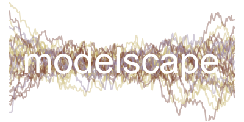

# README 

This repo stores code and output for a manuscript project related to understanding the limits to statistical learning in the life sciences

**Interpretable and predictive models to harness the life science data revolution**

Joshua P. Jahner, C. Alex Buerkle, Dustin G. Gannon, Eliza M. Grames, S. Eryn McFarlane, Andrew Siefert, Katherine L. Bell, Victoria L. DeLeo, Matthew L. Forister, Joshua G. Harrison, Daniel C. Laughlin, Amy C. Patterson, Breanna F. Powers, Chhaya M. Werner, Isabella A. Oleksy

Contact: Josh Jahner, jpjahner@gmail.com


This work was supported by the Modelscape Consortium with funding from the National Science Foundation (OIA-2019528).



More information is on a [Confluence
page](https://microcollaborative.atlassian.net/wiki/spaces/DR/pages/1692467204/Manuscript+project-Illustration+and+evaluation+of+sparse+learning+methods+for+ecology+and+evolution).

## Simulations

* The scripts used to build the simulated data used in this study are found in the *simulations* directory

* The final 36 core scenarios (100 replicates each) were created with sim_round5.R (by calling sparse_sim.R)

* The final 2 bigN scenarios (100 replicates each) were created with sim_bigN.R (by calling sparse_sim.R)

* See sim_grid_round5.csv and sim_grid_bigN.csv for scenario specifications


## Analyses of simulations

* The scripts used to run analyses and summarize output are found in the *analyses* directory

* Required functions for statistical analyses and calculating performance metrics are found in the *functions* directory

* Analysis of the 36 core scenarios implemented using sparse_wrapper.nf

```{bash}
module load arcc/1.0 nextflow/22.10.4
nextflow run -bg sparse_wrapper.nf -c beartooth.config
```

* Analysis of the 2 bigN scenarios implemented using bigN_wrapper.nf

```{bash}
module load arcc/1.0 nextflow/22.10.4
nextflow run -bg bigN_wrapper.nf -c beartooth.config
```

* Nextflow output for the 36 core scenarios was merged and downstream analyses were performed in the *output* directory

* Nextflow output for the 2 bigN scenarios was merged and downstream analyses were performed in the *bigN_out* directory 


### Scripts for manuscript figures

* Figure 1: analyses/output/example_fig.R

* Figure 2: analyses/output/core_out.R

* Figure 3: analyses/output/is_oos_plot.R

* Figure 4: analyses/output/variable_selection_plot.R

* Figure 5: analyses/bigN_out/bigN_out.R

* Figure S1: analyses/output/process_signal.R

* Figure S2: analyses/output/f1_oos_plot.R

* Figure S3: analyses/output/pip_thresh/pip_thresh_plot.R
